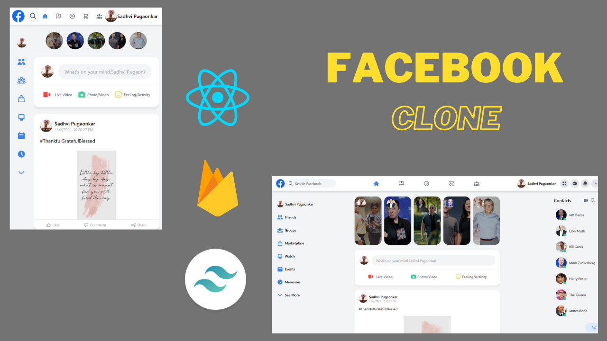

# Facebook Clone

This clone is built using React. The frontend is built using Next.js & Tailwind CSS. All the uploaded posts are stored in Firebase. These posts are then rendered on the frontend.

## Features

- Next.js Authentication
- Image Upload Functionality
- Server Side Rendering (SSR)
- Responsive

## Live Site

https://facebook-clone-v2.vercel.app/

## Screenshots

## Setup

- Run `npm i && npm run dev` or `yarn install && yarn run dev`
- Go to `localhost:3000`
